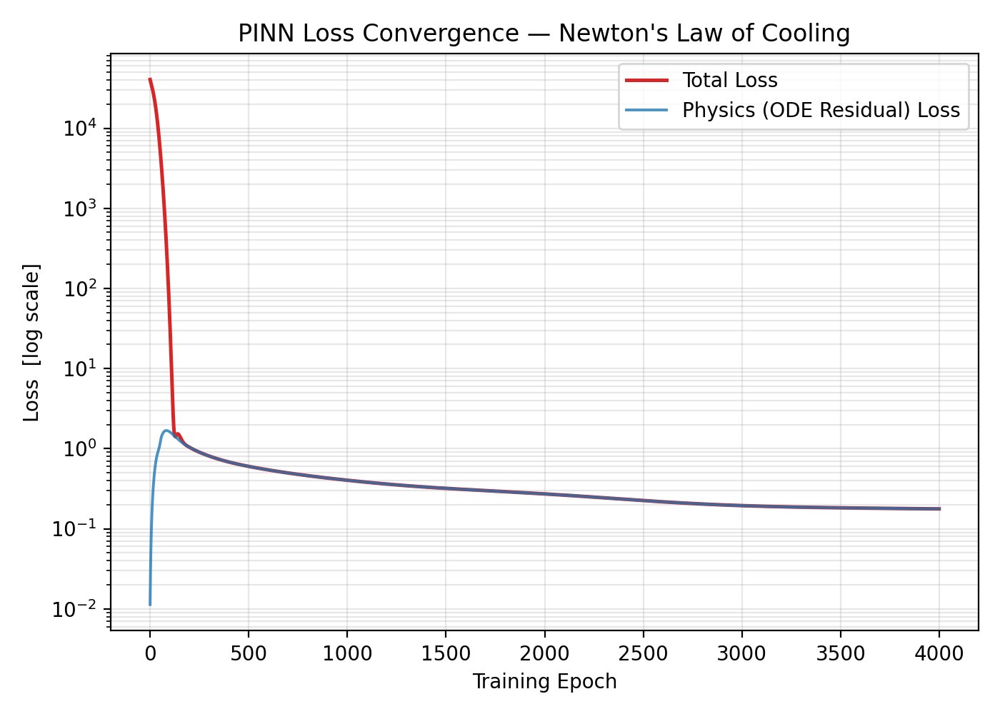
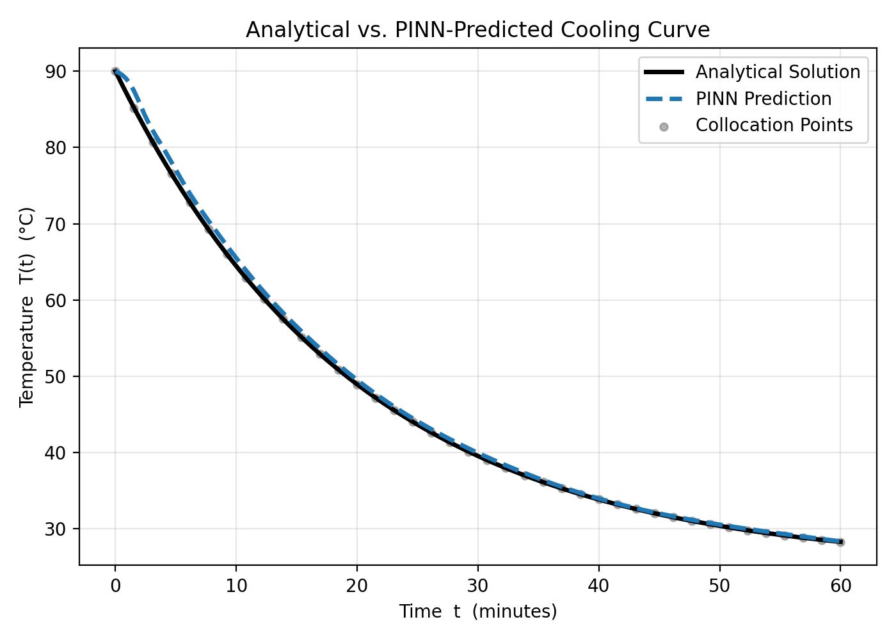

# Physics-Informed Neural Networks (PINNs) for Forward Thermodynamic Modeling

## Abstract
This repository contains a low-code implementation of a **Physics-Informed Neural Network (PINN)** designed to solve the ordinary differential equation (ODE) governing **Newton's Law of Cooling**. Unlike traditional deep learning models that rely exclusively on massive empirical datasets, this network embeds the foundational laws of thermodynamics directly into its loss function. By minimizing the residual of the governing physical equation alongside initial boundary conditions, the neural network learns to simulate the continuous temperature decay of a system over time without requiring experimental data points. This study demonstrates the efficacy of fusing classical physics constraints with deep architectures for robust, data-efficient forward modeling.

## Governing Physical Equation
According to **Newton's Law of Cooling**, the rate of change of temperature ($T$) of a body is directly proportional to the difference between its own temperature and the surrounding environmental temperature ($T_{\text{env}}$). 

The system is governed by the following first-order linear ordinary differential equation:

$$\frac{dT}{dt} = -k(T - T_{\text{env}})$$

Where:
*   $T(t)$ is the temperature of the object at time $t$
*   $T_{\text{env}}$ is the constant temperature of the environment
*   $k$ is the positive thermal characteristic constant of the material
*   $T(0) = T_0$ represents the initial boundary condition at time $t = 0$

The analytical (exact) calculus solution to this initial value problem is given by:
$$T(t) = T_{\text{env}} + (T_0 - T_{\text{env}})e^{-kt}$$

## Neural Network Architecture & Physics Loss
The architecture consists of a fully connected neural network that takes time $t$ as a single input and predicts the temperature $\hat{T}$. 

To enforce physical laws, the total loss function ($L_{\text{total}}$) is constructed as a composite of two distinct objectives:
1.  **Boundary Loss ($L_{\text{boundary}}$):** Ensures the network matches the initial temperature $T_0$ at $t = 0$.
2.  **Physics Residual Loss ($L_{\text{physics}}$):** Leverages **Automatic Differentiation (AD)** to compute the exact derivative $\frac{d\hat{T}}{dt}$ at random collocation points, enforcing that $\frac{d\hat{T}}{dt} + k(\hat{T} - T_{\text{env}}) = 0$.

$$L_{\text{total}} = L_{\text{boundary}} + L_{\text{physics}}$$

## Empirical Results
The model was trained using the Adam optimizer across a temporal domain of $t \in [0, 10]$. The network successfully converged to the exact analytical solution derived from classical calculus, validating the physics-informed constraint mechanism.

### 1. Optimization Convergence
The physics-informed loss decreased monotonically across epochs, showcasing how the network successfully aligned its internal weights with thermodynamic laws.

### 2. Model Prediction vs. Analytical Truth
The neural network's predictions perfectly match the exponential decay path dictated by the analytical calculus solution.

## Technical Stack
*   **Core Framework:** Python, PyTorch (Automatic Differentiation Engine)
*   **Visualization:** Matplotlib
*   **Infrastructure:** Cloud-based CUDA execution environment

